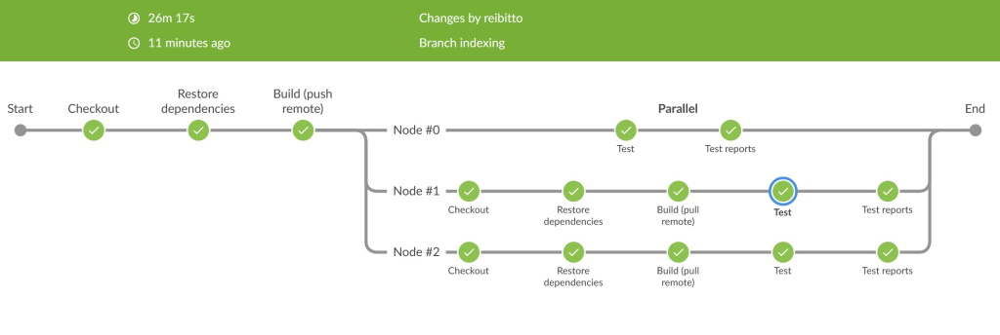

# sbt test shards


*An sbt plugin for splitting tests across multiple shards to speed up tests.*

## What is it?

Some projects have tests that take an incredibly long time. In such cases, CI turnaround time
can be frustratingly long. For example, say your tests take 45 minutes to complete in CI.
What you can instead do is split and run those tests across multiple nodes to speed up
the entire process. So what was once 45 minutes could turn into 15 minutes if you
distribute them across 3 nodes. `sbt-test-shards` aims to make setting up this workflow a
bit easier for you.



## Installation

Add the following to `project/plugins.sbt`:

```scala
addSbtPlugin("com.github.reibitto" % "sbt-test-shards" % "0.2.0")
```

## Configuration

Out of the box, the only thing that you must do is set the `testShard` and `testShardCount`
settings to the appropriate values. `testShardCount` identifies the number of shards/nodes
your tests will be split into. Let's say 3 for this example. `testShard` on the other hand
identifies _which_ shard is running the tests. So if we follow the example of 3 nodes,
`testShard` should be set to either 0, 1, or 2 (indexing is zero-based).

By default, `testShard` and `testShardCount` will look for the JVM properties called
`test.shard` and `test.shard.count` respectively. If none are found, it'll fallback to the
`TEST_SHARD` and `TEST_SHARD_COUNT` environment variables. Otherwise they will default to
`testShard=0` and `testShardCount=1` (which is essentially the same as not doing any sharding
at all).

If you want to use your own values, you can configure the sbt settings yourself:

```scala
testShard := yourShardId
testShardCount := 5
```

You may also need the following import depending on your project setup to have access to the keys:

```scala
import sbttestshards.TestShardsPlugin.autoImport.*
```

### Sharding algorithms

By default, the tests will be sharded by the test suite name (`ShardingAlgorithm.SuiteName`). 
This is convenient because it's automatic and requires no additional setup.
This works well if you have a lot of tests and/or you don't have any major outliers, such as 1 suite taking
an incredibly long time relative to all the others. If you have such outliers, the execution time for
the shards won't be perfectly balanced. So rather than nodes 0, 1, and 2 each taking 15 minutes to
complete, it may look like `node0 = 12 mins`, `node1 = 14 mins`, `node2 = 19 mins`.
This isn't optimal because you're waiting an extra 4 minutes for CI to complete because
`node2` is carrying more weight than the others.

To avoid the above case, you can use a different sharding algorithm called `ShardingAlgorithm.Balance`.
This takes in a list of test suite names and their execution times (rough estimates or averages are fine for this).
An example:

```scala
shardingAlgorithm := ShardingAlgorithm.Balance(
  tests = List(
    TestSuiteInfo("example.FooSpec", Some(Duration.ofSeconds(9))),
    TestSuiteInfo("example.BarSpec", Some(Duration.ofSeconds(3))),
    TestSuiteInfo("example.BazSpec", Some(Duration.ofSeconds(4))),
    // ...
  ),
  bucketCount = testShardCount.value,
  fallbackShardingAlgorithm = ShardingAlgorithm.SuiteName
)
```

As you can see, filling this out manually would be tedious and would require constant maintenance
as you add/remove tests (particularly if the tests are expensive). sbt automatically generates
test report xml files (JUnit-compatible format) when tests are run, and sbt-test-shards can consume
these reports so you don't have to manually manage this yourself. Example usage:

```scala
shardingAlgorithm := ShardingAlgorithm.Balance.fromJUnitReports(
  Seq(Paths.get(s"path-to-report-files")), // these will usually be located in the `target` folders
  shardsInfo = ShardingInfo(testShardCount.value)
)
```

For there to be test reports you have to first run `sbt test` on your entire project. And there's also
the issue that these files won't exist in your CI environment unless you cache/store them somewhere.
I'd recommend storing them remotely somewhere and then pulling them down in CI before running the tests.
And upon successful CI completion, publish the newly generated test reports remotely to keep them up to date.
This can be anywhere such as S3 or even storing them in an artifact as resources and publishing to a private
Maven repo.

### Additional configuration

If you're debugging and want to see logs in CI of which suites are set to run and which
are skipped, you can use `testShardDebug := true`

Also you can run `testDryRun` to see how each suite will be distributed without actually
running all the tests and waiting for them to complete.

## CI Configuration

### GitHub Actions

You'll want to [set up a matrix](https://docs.github.com/en/actions/using-jobs/using-a-matrix-for-your-jobs)
for your job. The matrix portion will look something like:

```yaml
matrix:
  shard: [0, 1, 2]
```

then in the `env` section where you run the `sbt test` command, you'll want to set the following:

```yaml
env:
  TEST_SHARD: ${{ matrix.shard }}
  TEST_SHARD_COUNT: 3
```

Of course you could instead pass in the `test.shard` and `test.shard.count` properties in the `sbt`
command if you so prefer (as mentioned earlier).
